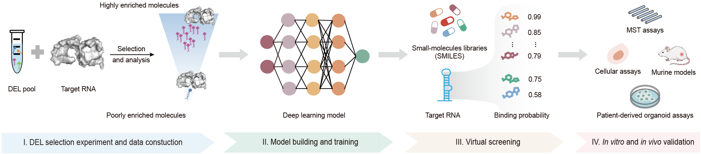

# ✨ DARTnet ✨

This is a [PyTorch](https://pytorch.org/) / [PyTorch Geometric](https://pytorch-geometric.readthedocs.io/) implementation of our study:

## 🎯 DARTnet: DEL-informed Artificial Intelligence for RNA-Targeted molecule discovery

RNA molecules represent an emerging class of therapeutic targets, but discovering small molecules that selectively recognize structured RNAs remains challenging. The lack of large-scale, target-specific RNA–small molecule interaction data limits the ability of computational methods to learn RNA-specific chemical preferences.

DARTnet is a DEL-informed deep learning framework for RNA-targeted small-molecule discovery. By learning target-specific chemical preferences from DNA-encoded library (DEL) screening-derived enrichment signals, DARTnet predicts RNA–small molecule binding probabilities and prioritizes high-confidence candidates from large chemical libraries. DARTnet integrates complementary molecular representations, including Morgan fingerprints, molecular graphs, and pretrained SMILES embeddings, through a hybrid multimodal fusion architecture combining attention-based modality gating and cross-modal feature interaction. A Kolmogorov–Arnold Network (KAN) prediction head is further used to model complex nonlinear relationships between molecular features and RNA-binding probability.

DARTnet was benchmarked on the HCV IRES Domain IIa RNA target, where it outperformed existing computational approaches and achieved a 70% experimental validation rate among high-confidence predictions using microscale thermophoresis (MST). DARTnet was further applied to disease-associated structured RNA targets, including coronavirus SL5 RNA elements, KRAS 5′UTR G-quadruplexes, and the PLEC S3E-1 structural splicing enhancer. The identified compounds showed strong binding activity and functional effects in reporter assays, cancer cell models, patient-derived organoids, and mouse models, demonstrating the potential of DARTnet for discovering functional small-molecule modulators of challenging RNA targets.

<p align="center">
  
</p>
<p align="center"><b>Overview of DARTnet workflow</b></p>

## 📖 Table of contents

- [🧬 Model architecture](#model-architecture)
- [⚙️ Installation](#installation)
- [📁 Repository structure](#repository-structure)
- [📥 Download pretrained weights](#download-pretrained-weights)
- [📊 Example dataset: HCV](#example-dataset-hcv)
- [🧪 Data format and preprocessing](#data-format-and-preprocessing)
- [🚀 Training](#training)
- [🔮 Inference](#inference)
- [📚 Citation and acknowledgements](#citation-and-acknowledgements)
- [☎️ Contact us](#contact-us)
- [⚠️ Disclaimer](#disclaimer)

---

<a id="model-architecture"></a>
## 🧬 Model architecture

DARTnet (c603) uses a fixed multimodal architecture (`graph+fp+emb` + `cross_interact` + `atteCat`):

```
SMILES
  ├─► Molecular graph (x, edge_index, edge_attr)
  │     └─► Node MLP (79→256) → Edge MLP (13→13)
  │           └─► 4× [GAT → BatchRenorm → Mish] + residual projection
  │                 └─► Global mean pool → LayerNorm  →  f_GNN [256]
  ├─► Morgan2048 fingerprint (ECFP4, radius=2)
  │     └─► MLP → f_FP [256]
  └─► MoLFormer embedding
        └─► MLPemb → f_EMB [100]

Hybrid multimodal fusion (atteCat)
  ├─ Gated multimodal fusion branch      → 456-d
  └─ Cross-modal interaction branch      → 3×48 = 144-d
        └─ Concatenate → 600-d → KAN head → sigmoid → P(bind)
```

| Module | Description |
|--------|-------------|
| GNN backbone | 4-layer GAT (2 heads, dropout=0.9) with edge features and skip-add residual |
| Fingerprint branch | Morgan ECFP4 (2048 bits), MLP projection to 256-d |
| Embedding branch | MoLFormer pretrained checkpoint for SMILES embeddings; MLPemb to 100-d |
| Fusion module | Hybrid multimodal fusion (gated + cross-modal branches) |
| Classification head | Efficient KAN (grid=5, hidden=64) + binary BCE |

> Run all commands from the **project root**: `python -m dartnet.train` / `python -m dartnet.predict`.

---

<a id="installation"></a>
## ⚙️ Installation

DARTnet uses **two Conda environments**:

| Environment | Purpose |
|-------------|---------|
| `DARTnet` **(Required)** | Main environment for training and inference |
| `MolTran_CUDA11` **(Optional)** | MoLFormer embedding extraction (subprocess) |

Check CUDA first:

```bash
nvidia-smi
# or
nvcc --version
```

> ❗ **Note:** The reference stack below is validated on Linux + **CUDA 12.1**. If your CUDA differs, change the PyTorch / PyG wheel URLs accordingly ([PyTorch](https://pytorch.org/get-started/previous-versions/), [PyG](https://pytorch-geometric.readthedocs.io/en/latest/install/installation.html)).

### 1️⃣ DARTnet environment

```bash
# 1) Create env
conda create -n DARTnet python=3.11 -y
conda activate DARTnet

# 2) PyTorch 2.5.1 + CUDA 12.1
pip install torch==2.5.1 torchvision==0.20.1 torchaudio==2.5.1 \
  --index-url https://download.pytorch.org/whl/cu121

# 3) PyTorch Geometric + extensions (must match torch/CUDA)
pip install torch_scatter torch_sparse torch_cluster \
  -f https://data.pyg.org/whl/torch-2.5.1+cu121.html
pip install torch-geometric==2.6.1

# 4) Remaining packages (pinned in requirements.txt)
pip install -r requirements.txt
```

**Reference versions (validated):**

| Package | Version |
|---------|---------|
| python | 3.11 |
| torch | 2.5.1 (+cu121) |
| torch-geometric | 2.6.1 |
| torch_scatter / torch_sparse / torch_cluster | matching `torch-2.5.1+cu121` wheels |
| pytorch-lightning | 2.5.2 |
| torchmetrics | 1.7.4 |
| rdkit-pypi | 2022.9.5 |
| pandas | 2.3.3 |
| numpy | 1.26.2 |
| ogb | 1.3.6 |
| transformers | 4.35.0 |
| bitsandbytes | 0.46.1 |

Quick check:

```bash
python -c "import torch, torch_geometric, pytorch_lightning, rdkit, ogb; print(torch.__version__, torch.cuda.is_available())"
```

### 2️⃣ MolTran_CUDA11 environment **(optional)**

**Purpose:** generate MoLFormer embedding files (`*_emb.pt`) from SMILES.  
**Skip if:** you use the precomputed embeddings in `dataset_HCV/` (`train_emb.pt` / `val_emb.pt` / `test_emb.pt`, plus inference `*_emb.pt`). Then only `DARTnet` is needed.  
**Install if:** you need embeddings for **new** SMILES / datasets (missing `*_emb.pt`).

Training/inference still runs in `DARTnet`. This env is only called as a subprocess when embeddings must be generated (`--molformer-env MolTran_CUDA11`).

```bash
# 1) Create env (name must match --molformer-env, default: MolTran_CUDA11)
conda create -n MolTran_CUDA11 python=3.8 -y
conda activate MolTran_CUDA11

# 2) PyTorch 1.7.1 + CUDA 11.0
conda install pytorch==1.7.1 torchvision==0.8.2 torchaudio==0.7.2 cudatoolkit=11.0 -c pytorch -y

# 3) Scientific stack + RDKit
conda install numpy=1.22.3 pandas=1.2.4 scikit-learn=0.24.2 scipy=1.6.2 -y
conda install rdkit=2023.03.3 -c conda-forge -y

# 4) Pip packages
pip install -r requirements-moltran.txt

# 5) Compile NVIDIA Apex from source (required by MoLFormer)
git clone https://github.com/NVIDIA/apex
cd apex
git checkout tags/22.03 -b v22.03
# Set CUDA_HOME to your CUDA 11 toolkit, e.g.:
# export CUDA_HOME=/usr/local/cuda-11.0
pip install -v --disable-pip-version-check --no-cache-dir --no-build-isolation \
  --config-settings "--build-option=--cpp_ext" \
  --config-settings "--build-option=--cuda_ext" ./
cd ..
```

Quick check:

```bash
python -c "import torch, pytorch_lightning, transformers, rdkit, fast_transformers, apex; print(torch.__version__)"
# expect: 1.7.1
```

Bundled assets used by embedding generation:

- `preprocessing/molformer/` — MoLFormer inference code + `hparams.yaml`
- `preprocessing/checkpoints/N-Step-Checkpoint_3_30000.ckpt` — weights (**Git LFS required**)

> ❗ **Note:** Alternative / official reference: IBM MoLFormer [environment.md](https://github.com/IBM/molformer/blob/main/environment.md). The steps above match our validated `MolTran_CUDA11` stack (Python 3.8 + torch 1.7.1+cu110).

---

<a id="repository-structure"></a>
## 📁 Repository structure

```
DARTnet/
├── requirements.txt            # pip deps (after installing torch + PyG)
├── dartnet/                    # Core package: train / predict / model / config
│   ├── train.py                # Training entry (train_tune / train_final)
│   ├── predict.py              # Inference entry
│   ├── model.py                # DartNet model definition
│   ├── config.py               # Argument serialization / run directory naming
│   └── efficient_kan.py        # KAN classification head
├── data_loading/               # Graph + Morgan + MoLFormer embedding pipeline
├── preprocessing/              # Embedding extraction + MoLFormer assets
│   └── checkpoints/            # MoLFormer weights (Git LFS)
├── utils/                      # BatchRenorm, metrics, etc.
├── requirements-moltran.txt    # pip deps for optional MolTran_CUDA11
├── dataset_HCV/                # Example target dataset (HCV IRES)
├── outputs/                    # Example DARTnet checkpoint (HCV)
├── train_cla2_final_version.sh # Example train / infer script
└── README.md
```

Clone and enter the repository:

```bash
git clone https://github.com/lyli1013/DARTnet.git
cd DARTnet
conda activate DARTnet
```

---

<a id="download-pretrained-weights"></a>
## 📥 Download pretrained weights

### 1️⃣ DARTnet model weights (~12 MB)

Included in this repo (normal Git — **no LFS needed**):

```text
outputs/out_S5_dataset_HCV_final/<RUN_DIR>/last.ckpt
```

`<RUN_DIR>` =

```text
GNN+DEL+T=Label+S=42+GAT+GC=0.5+OPTD=1e-10+OH=True+NDIM=256+NL=4+GIDIM=256+GATH=2+GATD=0.9+BS=32+ESP=5+lr=0.0001_atteCat_embdrop0.1_fpdrop0.5_gnndrop0.0
```

Use `last.ckpt` as `--ckpt-path` for inference (keep `gnn_hyperparameters.json` in the same folder).

### 2️⃣ MoLFormer checkpoint (~536 MB, **optional**)

Needed only to **regenerate** embeddings for new molecules. Skip if you use precomputed `dataset_HCV/*_emb.pt`.

```text
preprocessing/checkpoints/N-Step-Checkpoint_3_30000.ckpt
```

Download options:

1. **Git LFS** (after installing [Git LFS](https://git-lfs.com)):

```bash
git lfs install
git lfs pull
```

2. **Browser:** open the file on GitHub and download manually, then place it at the path above.

Without LFS / without a manual download, you only get a tiny pointer file, not the real weights.

---

<a id="example-dataset-hcv"></a>
## 📊 Example dataset: HCV

`dataset_HCV/` is a **demo target dataset** for GitHub, corresponding to DEL binary classification for the HCV IRES RNA target (split aligned with internal `data_S5_balanced_v1/split_1`).

### Files

| File | Description | Approx. size |
|------|-------------|--------------|
| `train_set.csv` | Training set | 1,709 |
| `val_set.csv` | Validation set | 408 |
| `test_set.csv` | Test set | 507 |
| `train_emb.pt` / `val_emb.pt` / `test_emb.pt` | **Precomputed** MoLFormer embeddings (skip MolTran) | — |
| `S5_validated_test_set_1118_unique*.csv` | Wet-lab validated molecules (inference) | 18 |
| `S5_*_emb.pt` | Precomputed embeddings for the inference CSVs | — |
| `FDA_smiles_2349_20251022.csv` | FDA-approved drug SMILES (optional screening) | 2,349 |

### Training CSV format

Header row, comma-separated. The following three columns are **required**:

| Column | Description |
|--------|-------------|
| `FeatureIndex` | Unique sample ID (matches keys in embedding `.pt` files) |
| `Smiles` | Small-molecule SMILES string |
| `Label` | Binary label (0 = non-binder, 1 = binder) |

Example:

```csv
FeatureIndex,Smiles,Label
HGODEL0034-240-32-159,CC(=O)N1CC(N(C)C(=O)C2(Cc3cccc(-c4noc(-c5ccc6ncn(C)c6c5)n4)c3)CC2)C1,1
HGODEL0034-190-84-159,CC(=O)NC1CCN(C(=O)CCc2cccc(-c3noc(-c4ccc5ncn(C)c5c4)n3)c2)CC1,1
```

### Inference CSV format

Name the file `{infer_file_name}.csv` and place it under `--data-path`.

At minimum include `FeatureIndex` and `Smiles`. Extra columns (e.g. `original_Smiles`, `Duplicate_FeatureIndex`) are allowed and ignored.

Example (`S5_validated_test_set_1118_unique_20260129.csv`):

```csv
FeatureIndex,original_Smiles,Smiles,Duplicate_FeatureIndex
lsis-11,C12=C3C(=CC=C1OC(C2)CN(C)C)N=C([N]3CCCN(C)C)N([H])[H],CN(C)CCCn1c(N)nc2ccc3c(c21)CC(CN(C)C)O3,Isis_11
```

> **Background:** This validation set is used to predict HCV IRES RNA binders for wet-lab MST follow-up. See the DARTnet paper for experimental details (citation to be updated upon publication).

---

<a id="data-format-and-preprocessing"></a>
## 🧪 Data format and preprocessing

### SMILES canonicalization

`data_loading` canonicalizes all input SMILES with RDKit (`data_loading/smiles_canonical.py`) so GNN and Morgan fingerprints stay consistent.

> ⚠️ **Important:** If the directory contains **legacy** cached `.pt` files (generated before unified canonicalization), delete them and regenerate; otherwise train/infer features may be inconsistent:
>
> ```bash
> rm -f dataset_HCV/DEL_*_morgan2048_emb.pt
> rm -f dataset_HCV/*_emb.pt
> rm -f dataset_HCV/S5_*_morgan2048_emb.pt
> ```

### Automatic feature caching

On the first training or inference run, the pipeline will:

1. Read CSV → build PyG molecular graphs (node/edge features)
2. Compute Morgan2048 fingerprints in parallel
3. Generate MoLFormer embeddings via `MolTran_CUDA11` (if `*_emb.pt` is missing)
4. Cache full features as `.pt` files for faster subsequent runs

| Source CSV | Cached files |
|------------|--------------|
| `train_set.csv` | `DEL_train_Label_morgan2048_emb.pt` + `train_emb.pt` |
| `val_set.csv` | `DEL_val_Label_morgan2048_emb.pt` + `val_emb.pt` |
| `test_set.csv` | `DEL_test_Label_morgan2048_emb.pt` + `test_emb.pt` |
| `{infer_file_name}.csv` | `{infer_file_name}_morgan2048_emb.pt` + `{infer_file_name}_emb.pt` |

### Standalone embedding extraction (optional)

```bash
python preprocessing/extract_embeddings.py \
    --data-dir ./dataset_HCV \
    --ckpt-path /path/to/N-Step-Checkpoint_3_30000.ckpt \
    --molformer-env MolTran_CUDA11 \
    --device cuda:0
```

See [`preprocessing/README.md`](preprocessing/README.md) for more details.

---

<a id="training"></a>
## 🚀 Training

DARTnet uses a **two-stage training** strategy:

| Stage | `--train_stage` | Description |
|-------|-----------------|-------------|
| Tuning | `train_tune` | train/val split, early stopping, monitor **Validation PRAUC** |
| Final model | `train_final` | Merge train + val; fixed epoch count (from the best tune checkpoint epoch) |

### ▶️ Quick start (HCV example)

```bash
cd DARTnet
conda activate DARTnet

export MOLFORMER_CKPT="/path/to/N-Step-Checkpoint_3_30000.ckpt"
export OUT="./output/dataset_HCV"

# Stage 1: train_tune
python -m dartnet.train \
    --train_stage train_tune \
    --dataset-dir ./dataset_HCV \
    --dataset-id dataset_HCV \
    --molformer-ckpt-path "${MOLFORMER_CKPT}" \
    --molformer-env MolTran_CUDA11 \
    --out-path "${OUT}" \
    --gpu-devices 0

# Stage 2: train_final (uses best tune epoch; writes to ${OUT}_final/)
python -m dartnet.train \
    --train_stage train_final \
    --dataset-dir ./dataset_HCV \
    --dataset-id dataset_HCV \
    --molformer-ckpt-path "${MOLFORMER_CKPT}" \
    --molformer-env MolTran_CUDA11 \
    --out-path "${OUT}" \
    --gpu-devices 0
```

Or use the wrapper script (edit `MOLFORMER_CKPT` and output paths first):

```bash
bash experiments/train_cla2_final_version.sh
# or
bash train_cla2_final_version.sh
```

### Output directory naming

The run directory name is auto-built from hyperparameters (`get_gnn_wandb_name`). Default c603:

```
GNN+DEL+T=Label+S=42+GAT+GC=0.5+OPTD=1e-10+OH=True+NDIM=256+NL=4+GIDIM=256+GATH=2+GATD=0.9+BS=32+ESP=5+lr=0.0001_atteCat_embdrop0.1_fpdrop0.5_gnndrop0.0
```

Example paths:

```
output/dataset_HCV/<RUN_DIR>/          # train_tune checkpoints + metrics
output/dataset_HCV_final/<RUN_DIR>/    # train_final checkpoints + test metrics
```

### Main CLI arguments

| Argument | Default | Description |
|----------|---------|-------------|
| `--train_stage` | (required) | `train_tune` or `train_final` |
| `--dataset-dir` | — | Dataset folder containing CSVs |
| `--dataset-id` | `split_1` | Identifier used in logs / metric filenames |
| `--molformer-ckpt-path` | — | MoLFormer weights (required when using emb) |
| `--molformer-env` | `MolTran_CUDA11` | Conda env for embedding subprocess |
| `--out-path` | — | Output root directory |
| `--gpu-devices` | `2` | GPU device index |
| `--seed` | `42` | Random seed |
| `--batch-size` | `32` | Batch size |
| `--lr` | `1e-4` | Learning rate |
| `--early-stopping-patience` | `5` | Early-stopping patience (tune only) |

List all arguments:

```bash
python -m dartnet.train --help
```

---

<a id="inference"></a>
## 🔮 Inference

Use the checkpoint from `train_final` to score new SMILES.

### ▶️ Example command

```bash
conda activate DARTnet

RUN_DIR="GNN+DEL+T=Label+S=42+GAT+GC=0.5+OPTD=1e-10+OH=True+NDIM=256+NL=4+GIDIM=256+GATH=2+GATD=0.9+BS=32+ESP=5+lr=0.0001_atteCat_embdrop0.1_fpdrop0.5_gnndrop0.0"

python -m dartnet.predict \
    --infer \
    --ckpt-path "./output/dataset_HCV_final/${RUN_DIR}/last.ckpt" \
    --data-path ./dataset_HCV \
    --infer-file-name S5_validated_test_set_1118_unique_20260129 \
    --molformer-ckpt-path /path/to/N-Step-Checkpoint_3_30000.ckpt \
    --molformer-env MolTran_CUDA11 \
    --output-path "./output/dataset_HCV_final/${RUN_DIR}" \
    --use-gpu
```

### Output

Predictions are written to:

```
{output-path}/infer/predictions_{infer_file_name}_({N_pos}).csv
```

where `{N_pos}` is the number of samples with predicted probability > 0.5. Columns:

| Column | Description |
|--------|-------------|
| `ID` | Sample `FeatureIndex` |
| `Prediction` | Binding probability (sigmoid, 0–1) |

> **Note:** In `dartnet/predict.py`, `Trainer(devices=[...])` may hard-code a GPU index. Edit the `devices` list if it does not match your machine.

---


---

<a id="citation-and-acknowledgements"></a>
## 📚 Citation and acknowledgements

If you find DARTnet useful in your research, please cite this repository and the DARTnet paper when available:

```
DARTnet: Deep learning for activity prediction of RNA-targeting small molecules
from target-enrichment libraries.
GitHub: https://github.com/lyli1013/DARTnet
(Paper citation to be updated upon publication.)
```

**Related resources:**

- [IBM MoLFormer](https://github.com/IBM/molformer) — chemical language model used for SMILES embeddings
- [PyTorch Geometric](https://github.com/pyg-team/pytorch_geometric) — molecular graph neural networks
- [EfficientKAN](https://github.com/Blealtan/efficient-kan) — Kolmogorov–Arnold Network implementation used in the classification head

---

<a id="contact-us"></a>
## ☎️ Contact us

Please contact us if you are interested in our work or potential academic collaborations.

- (Contact information to be added)

---

<a id="disclaimer"></a>
## ⚠️ Disclaimer

Predictions from DARTnet are for computational decision support only and **do not replace** wet-lab validation. Please have experts review results before MST, cellular assays, or other follow-up experiments. This software is provided "as is", and the authors are not liable for any loss arising from its use.
